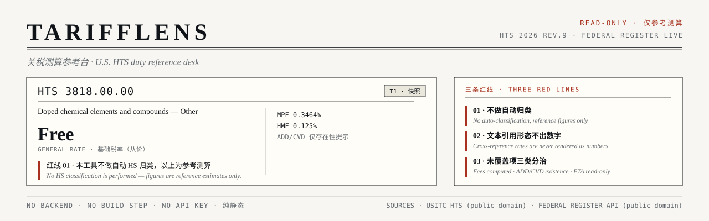

<h1 align="center" style="font-size:2.4rem;letter-spacing:.06em;margin-bottom:.2rem">TariffLens</h1>
<p align="center"><strong>关税测算参考台 · U.S. HTS Duty Reference Desk</strong></p>

<p align="center">
  <a href="README.en.md">English</a> ·
  <strong>简体中文</strong>
</p>



<p align="center">
  
  
  
  
  
</p>

输入一个 HTS 子目，看到它当下被哪些措施覆盖、每个数字出自哪里 —— 以及**哪些部分本工具不替你算**。

> **适用范围（重要）**：目前**只覆盖美国进口**。税则来自 USITC 的 HTS 2026 rev.9，措施来自 Federal Register（含 ADD/CVD 与 §232 / §301 类公告），规费按 CBP FY2026 的 MPF / HMF。
> 欧盟（TARIC）、英国（UK Trade Tariff）、中国（海关税则）等其他市场**不在覆盖范围内** —— 它们各有独立的数据源与口径，不是加个开关就能切换的。

TariffLens 是 [supply-chain-portfolio](https://github.com/SummerPapaya/supply-chain-portfolio)「衍生应用」序列的第 2 项（#2 关税与贸易合规自动化）。它是一个**纯静态站点**：无后端、无构建步骤、无 API 密钥，数据全部在构建期预取并随仓库分发，浏览器直接读取。

- **在线预览**：https://summerpapaya.github.io/tarifflens/ （推送并开启 Pages 后生效）
- **规格书**：[`docs/spec.html`](docs/spec.html)（v1.3，12 项设计确认全部落地）
- **数据管线验证报告**：[`docs/pipeline-report.html`](docs/pipeline-report.html)

---

## 一、三条红线（这是产品逻辑，不是免责脚注）

工具的价值边界先于功能定义。以下三条在 UI 上是**可见状态**——每次查询都会出现，不折叠、不在页脚：

| # | 红线 | UI 行为 |
|---|------|---------|
| 01 | **不做自动 HS 归类** | 只出「参考测算」。检索命中即展示，但从不替用户判定商品应归哪个子目。 |
| 02 | **文本引用形态拒绝输出数字** | 税率字段若形如 `"The duty provided in..."`（形态码 `rk=t`），一律不出数字、不估算，只显示原文出处。 |
| 03 | **未覆盖项三类分治** | 规费（MPF / HMF）可算 → 正常输出；ADD/CVD 只出**存在性提示**、不出金额；FTA / 原产地 / 归类 → 只读提示 + 免责。 |

## 二、三层数据架构

| 层 | 来源 | 形态 | 说明 |
|----|------|------|------|
| L2 实时 | [Federal Register API](https://www.federalregister.gov/api/v1/documents.json) | 浏览器直连 | CORS `*`、免密钥。拉取近 90 天关税类与 ADD/CVD 类文档，含 `effective_on` / `comments_close_on`。 |
| L1 快照 | USITC HTS 2026 rev.9 整表 | 构建期预取 | 35,502 行 → 按章切 gzip 分片，浏览器 `DecompressionStream('gzip')` 解压。首屏仅载 index（约 37 KB）。 |
| L3 演示 | 内置样例 | 仓库内置 | 网络不可用时仍可完整演示。 |

**分片策略**：按章（99 章 + Ch99 引用表）切分，中位体积约 1.6 KB，按需加载；`manifest.json` 记录版本、抓取时间、各分片体积与 sha256，UI 的「证据链」栏目会把它渲染出来供核对。

> 解码层做了兜底：先判 gzip magic bytes，托管平台若已代理解压则按裸 JSON 解析，避免换环境后整站取不到数。

### 怎么用（三步）

1. **输入 HTS 子目** —— 8 位或 10 位均可；不确定编码时，点页面上的品类示例，或用「**按类别浏览**」从 97 个章逐级下钻到具体税则行。
2. **自上而下读两层证据** —— L1 快照（基础税率 + Chapter 99，墨黑边条）→ L2 实时（公告 + ADD/CVD，靛蓝边条）。两块各自可折叠，默认折叠，点标题展开；折叠时标题栏也带该层的关键数字。
3. **先读红线，再看数字** —— 朱红旁注说明「哪些不替你算」；**参考测算默认展开**，但只算「基础税 + MPF + HMF」，页面上方写明每个输入值来自哪里。

页面上方还有一份默认折叠的「怎么读这份表」图例，其中专门有一节讲 **L1 与 L2 的边界**：按时间（构建期快照 vs 打开页面这一刻的实时取数）、按内容（税率这个数 vs 动作这件事）、按边条颜色（墨黑 vs 靛蓝）。

> **参考测算的输入来源**：货值与运输方式由用户填写；基础税率来自 L1 快照；MPF / HMF 是 CBP FY2026 公布的规费费率（预填、可改）。它**不是**第三层数据 —— L3 是离线演示样例层。测算不含 Chapter 99 附加税、ADD/CVD、FTA 优惠与原产地判定，这几项在 L1 / L2 栏目里逐条列出但不出金额。

### 端到端验证样例（`docs/pipeline-report.html`）

8 条，每条对应一条设计意图 —— 它们是**回归用例**，不是品类清单：

| 编码 | 品类 | 基础税率 | Ch.99 | ADD/CVD | 验证什么 |
|------|------|---------|-------|---------|----------|
| `8507.60.00` | 电子 · 锂电池 | 3.4% | 3 | 0 | 从价税与附加措施并存 |
| `2804.61.00.00` | 化工 · 多晶硅 | Free | 0 | 0 | **红线 01**：快照为 Free，实时层却有措施 |
| `7210.11.00` | 钢铁 · 镀锡钢板 | Free | 0 | 2 | 前缀回退 + ADD/CVD 存在性提示 |
| `0201.10.50` | 畜牧 · 牛肉 | 26.4% | 32 | 0 | 祖先链还原品名 + 高税档展示 |
| `1005.90.20` | 粮食 · 玉米 | `0.05¢/kg` | 0 | 0 | **红线 02**：从量形态，拒绝换算成数字 |
| `6403.99.90` | 鞋类 · 皮鞋 | 10% | 8 | 0 | 附加措施密集命中时的去重与截断 |
| `6109.10.00` | 服装 · T 恤 | 16.5% | 0 | 0 | 高从价税 + 规费测算 |
| `8481.80.90` | 机械 · 阀门 | 2% | 5 | 0 | 多措施叠加时的排序与溢出 |

> 想看别的品类：UI 与验证页都可以直接输入任意 HS 码，验证页还有「随机抽一条」。往
> `scripts/verify_tariff_data.py` 的 `SAMPLES` 加一行，重跑脚本即可把该品类写进报告。

## 三、目录结构

```
index.html                 正式 UI（Gazette 公报版式，中英双语 × 亮/暗四态）
verify.html                数据层验证页（与 UI 同源，逐项对照四样例）
data/                      数据产物（随仓库提交，约 1.2 MB）
  manifest.json            版本 / 抓取时间 / 分片体积与 sha256
  hts-2026rev9-index.json.gz
  hts-2026rev9-chNN.json.gz      按章分片（99 章）
  hts-2026rev9-ch99*.json.gz     Chapter 99 附加措施 + 反查索引
  hts-2026rev9-browse.json.gz    「按类别浏览」索引：97 章 → 1,250 个 4 位 heading（38 KB，懒加载）
  fr-tariff-20260928.json.gz     关税类联邦公报文档
  fr-adcvd-20260928.json.gz      反倾销/反补贴文档
scripts/
  fetch_tariff_data.py     数据管线：hts / fr / all
  build_browse_index.py    生成「按类别浏览」索引（章 → 4 位 heading）
  verify_tariff_data.py    四样例端到端验证 → docs/pipeline-report.html
tools/
  serve.py                 本地静态服务器（.gz 按 octet-stream 发送，复现线上取数路径）
docs/
  spec.html                规格书 v1.3
  pipeline-report.html     数据管线验证报告
assets/
  hero.svg                 README 头图（Gazette 版式，与 UI 同色板）
cache/                     构建期缓存（gitignore）
```

## 四、本地运行

```bash
python3 tools/serve.py 8771      # 必须走服务器：file:// 下 fetch 会被 CORS 拦
open http://127.0.0.1:8771/                 # 正式 UI
open http://127.0.0.1:8771/verify.html      # 数据层验证页
```

刷新数据（需联网，USITC 整表较大，缓存落在 `cache/`）：

```bash
python3 scripts/fetch_tariff_data.py all    # HTS 按章分片 + Federal Register 快照
python3 scripts/verify_tariff_data.py       # 重跑四样例验证并刷新报告
```

## 五、设计：Gazette

没有沿用 VeloCortex 的暗色指挥台风格 —— 那套视觉语言暗示「实时掌控」，与本项目「只做参考测算」的红线相冲突。

Gazette 借用政府公报与法律简报的排版语汇：纸色底、衬线正文、双细线表格、竖细线分栏、朱红勘校旁注，并引入**四级置信度标度（T0–T3）**，让「这个数有多可信」在版面上直接可见，而不是藏在 tooltip 里。

## 六、数据来源与许可

- **HTS 数据**：USITC（美国政府机构作品，public domain）
- **联邦公报文档**：Federal Register API（public domain，免密钥）
- **商业 AIS / 关务数据**：**未接入**，仅提供外部链接跳转

代码以 **MIT** 发布（见 [`LICENSE`](LICENSE)），数据为公共领域。

---

## License

MIT License — Copyright (c) 2026 SummerPapaya. See [`LICENSE`](LICENSE) for the full text.

本工具输出仅供参考，不构成报关或法律意见。归类与税率适用以 CBP 裁定及最新 HTS 文本为准。
